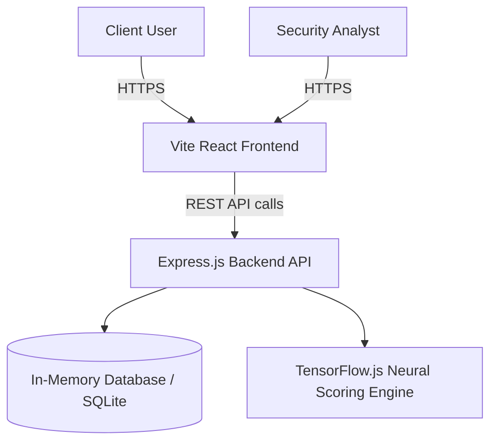

# Project Architecture

The Vanguard Insider Threat Portal is designed with a decoupled frontend and backend to ensure scalability and maintainability.

## High-Level Diagram

## Components

### Frontend (React + Vite)
- **Framework:** React 19 bootstrapped with Vite for instant Hot Module Replacement (HMR) and optimized builds.
- **Styling:** Tailwind CSS v3.4 configured with `darkMode: 'selector'` for robust Light/Dark theme toggling. The color palette is inspired by the U.S. Web Design System (USWDS) to project authority and trust, heavily modified to suit Bank of Maharashtra's branding.
- **State Management:** React hooks (`useState`, `useEffect`) manage local application state, minimizing complex boilerplate.
- **Routing:** React Router v6 provides seamless Client-Side Routing between the Login screen, Security Dashboard, and the mock Client Portal.
- **Charting:** Recharts is utilized for rendering responsive Risk Trajectory lines and Distribution pie charts.

### Backend (Node.js + Express)
- **API Design:** RESTful endpoints for fetching employee data (`/api/employees`), triggering containment workflows (`/api/contain`), and retrieving telemetry.
- **Mock Data Layer:** A dynamic, in-memory state engine simulates a living enterprise environment where employees generate transactional and behavioral logs in real-time.
- **Threat Engine Placeholder:** The application architecture integrates points where a TensorFlow.js model evaluates incoming telemetry against a baseline to update the `riskScore`.

## Security Features Built-In
- **Zero Trust UI Restrictions:** The Dashboard restricts actions based on the `riskScore`. High-risk employees can be subjected to immediate SOAR (Security Orchestration, Automation, and Response) containment.
- **QPC Artefact Validation:** The architecture simulates the presence of Quantum-Proof Cryptography by validating signatures (CRYSTALS-Kyber) on the Client Portal.
